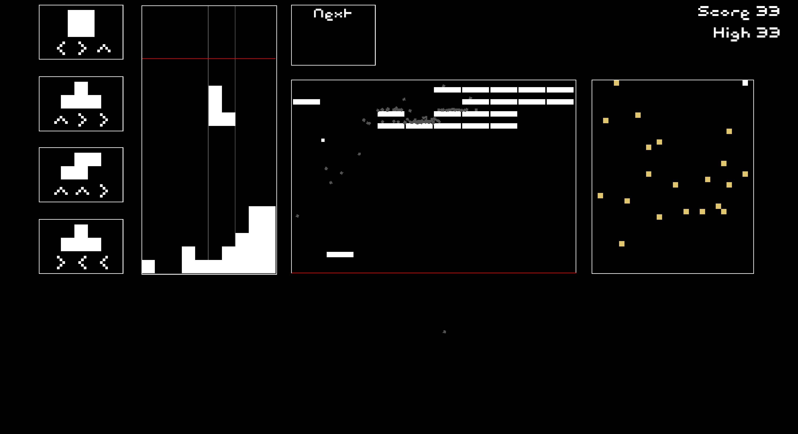

# Blocks ++

Do you feel like tetris is too easy? Think you're good at multitasking?

Play Blocks++ now at [blocks.ilus.pw](https://blocks.ilus.pw/) (chromium-based browsers only), or [download for desktop](https://github.com/julie-42/blocks-plus-plus/releases)!



Built with [Godot-Rust](https://github.com/godot-rust/gdext).

## Development

Install Rust & Godot.

Build the rust lib from the rust directory:

```
cargo build --target x86_64-unknown-linux-gnu
```

The targets are specified at `./godot/rust.gdextension`, you'll need to build a debug build for the OS you're running, and for the export platform you're targeting.

You can now open the Godot project and run a dev build, or export the game.

If you open the Godot project when the lib is missing, Godot will automatically convert the custom Godot-Rust types to their base objects (Node2D...). If that happens, reset those changes with git and check your cargo build settings.

For wasm, debug builds always fail when the export is opened in browser (`null function or function signature mismatch`).

## Credits

- [Pixel Font](https://www.1001fonts.com/pixel-font.html) By [Dale Harris](https://www.1001fonts.com/users/utopia/)
- [Github icon](https://iconduck.com/icons/313558/github)
